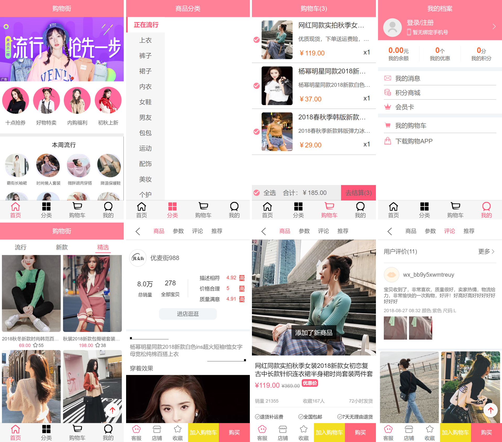

# 基于 Vue 的购物商城 Web APP

### 效果截屏


### 项目结构
```js

|-- public            // 项目公共部分
|-- src              // 源码目录 
|   |-- assets          // 公共的css样式和img
|   |-- common     // 工具函数和mixin混合函数
|   |-- components   // 组件目录
|       |--common      // 很常用的组件封装，可以在其他项目中使用
|           |--navbar       // 顶部导航栏
|           |--scroll          // Better-Scroll插件封装
|           |--swiper         // 轮播图组件
|           |--tabbar        // 底部导航栏
|           |--toast           // toast弹窗
|       |--content        // 根据项目业务封装的组件
|           |--backTop         // 回到顶部组件
|           |--checkButton          // 点击勾选组件
|           |--goods           // 首页商品展示组件
|           |--mainTabBar     // 项目底部导航栏
|           |--tabControl           // 首页商品分类展示组件
|   |-- network        // 网络请求
|   |-- router          // 路由
|   |-- store       // vuex状态管理
|   |-- views        // 全局状态hox目录
|       |--cart               // 购物车模块
|       |--category      // 分类模块
|       |--detail           // 详情页模块
|       |--home          // 首页模块
|       |--profile        // 我的模块
|   |-- App.vue      // 入口文件
|   |-- main.js       // vue挂载文件
|-- .browserslistrc       // 浏览器相关设置
|-- .editorconfig        //代码格式约束文件
|-- .gitignore              // 忽略git
|-- babel.config.js	 // babel配置文件
|-- package-lock.json     // npm入口
|-- package.json        // 安装包管理文件
|-- README.md        // 项目说明
|-- vue.config.js       // 自定义vue配置文件			 
```

### 项目进度
	* 首页开发：
		* navbar封装
		* 网络数据请求
		* swiper轮播图封装
		* recommend推荐模块
		* FeatureView模块
		* 解决navbar滚动问题，需要navbar固定不动
		* TabControl模块封装，并设置吸顶效果
		* 首页商品数据请求
		* 商品数据展示模块goods，点击tabControl切换商品数据
		* 解决移动端滑动页面流畅性（better-scroll替换原生滚动)
			* better-scroll封装与应用
			* 解决首页中better-scroll滚动卡顿的问题
		* backTop（回到顶部按钮）组件封装，滑动位置到1000以后按钮显示，小于1000按钮消失
		* 完成上拉加载更多功能
		* 从首页切换到其他页面后返回首页依旧保持切换出去时的页面
	* 商品详情页开发
		* 从首页点击商品跳转商品详情页面
		* 详情页面的navBar模块
		* 网络数据请求
		* 商品轮播图展示
		* 价格销量等商品信息展示、店铺信息展示、商品信息、参数信息展示
		* 商品评论信息展示
		* 推荐模块展示
		* 点击navBar中的标题，滚动到对应的主题
		* 详情页面滑动到某个主题模块，navBar的对应的标题要切换
		* bottomBar开发，点击加入购物车添加对应商品到购物车
	* 购物车开发
		* 购物车顶部导航栏
		* 购物车商品展示
		* 商品选中与不选中
		* 购物车底部封装：全选按钮、动态计算商品合计价格、去结算中动态计算商品数量
		* 购物车全选按钮功能
	* Toast组件封装（以插件的形式封装）
		* 详情页内添加商品，弹出弹框显示添加成功
	* 分类页面开发
		* 从服务器请求分类数据
		* 封装left-bar展示分类数据
		* 点击left-bar上的item高亮显示
	* 我的页面开发

### 技术栈
- **Vue.js**
- **Vue-CLI**（项目搭建）
- **Vue-router**（路由）
- **vuex**（状态管理）
- **ES6**
- **Ajax**（网络请求）
- **Better-Scroll**（移动端滚动）
- **Webpack**（打包器）
- **IconFont**（图标）
- ...
感谢coderwhy提供的API接口

## 项目安装使用
```
npm install
```

### Compiles and hot-reloads for development
```
npm run serve
```

### Compiles and minifies for production
```
npm run build
```

### Customize configuration
See [Configuration Reference](https://cli.vuejs.org/config/).


